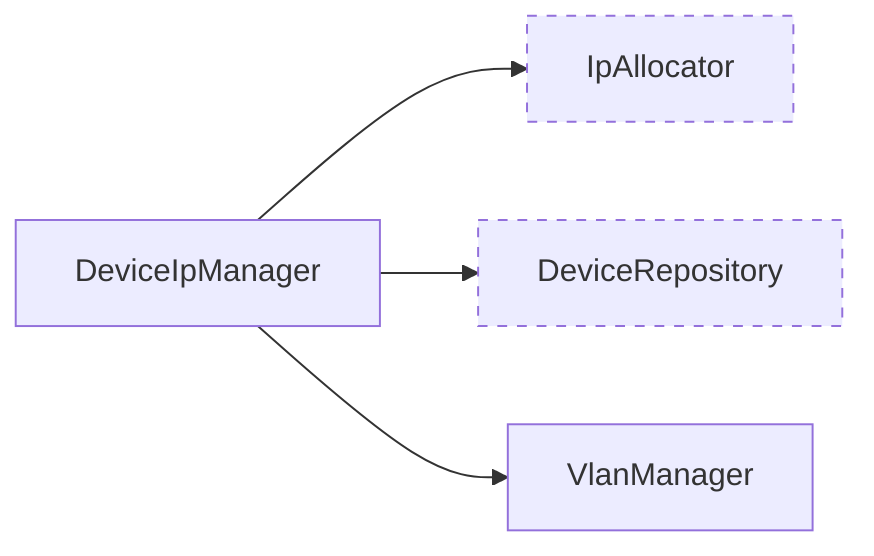
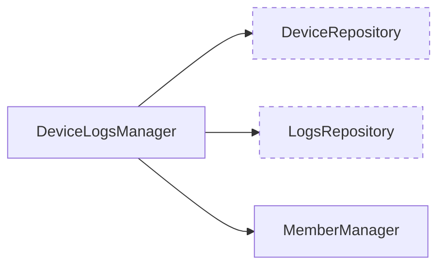
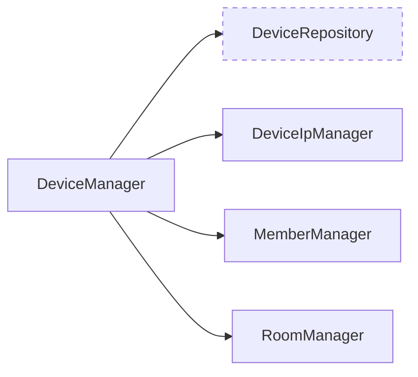

# Module `device`

## Schéma de dépendence par manager
### DeviceIpManager

```mermaid
flowchart LR
    style IpAllocator fill:stroke-width:2px, stroke-dasharray: 5 5
    style DeviceRepository fill:stroke-width:2px, stroke-dasharray: 5 5

    DeviceIpManager --> IpAllocator
    DeviceIpManager --> DeviceRepository
    DeviceIpManager --> VlanManager
```

### DeviceLogsManager

```mermaid
flowchart LR
    style DeviceRepository fill:stroke-width:2px, stroke-dasharray: 5 5
    style LogsRepository fill:stroke-width:2px, stroke-dasharray: 5 5

    DeviceLogsManager --> DeviceRepository
    DeviceLogsManager --> LogsRepository
    DeviceLogsManager --> MemberManager
```

### DeviceManager

```mermaid
flowchart LR
    style DeviceRepository fill:stroke-width:2px, stroke-dasharray: 5 5

    DeviceManager --> DeviceRepository
    DeviceManager --> DeviceIpManager
    DeviceManager --> MemberManager
    DeviceManager --> RoomManager
```
