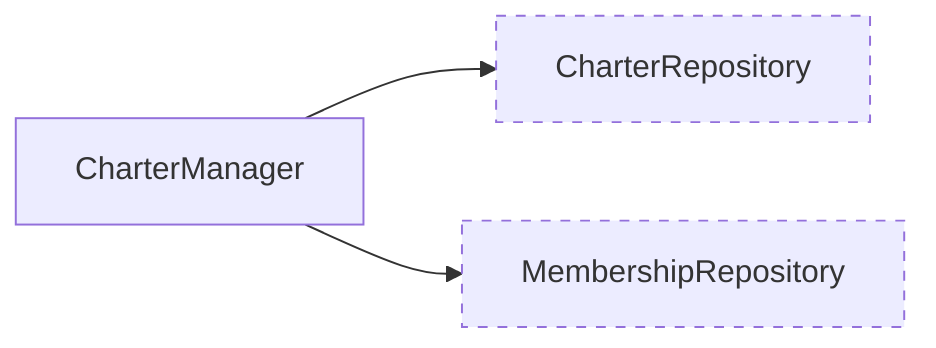
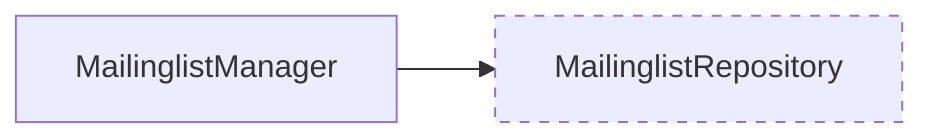
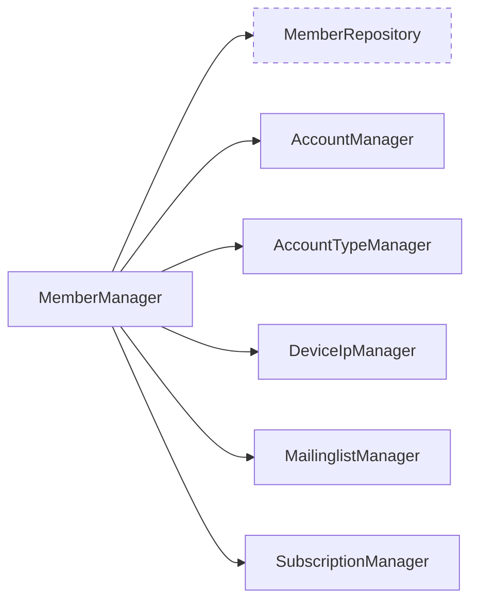
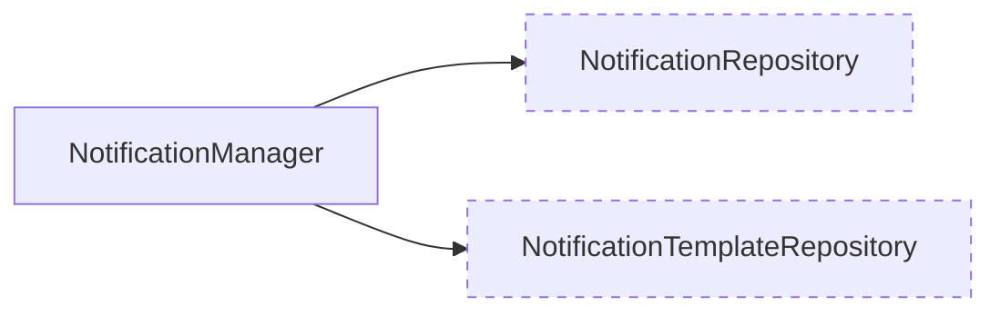
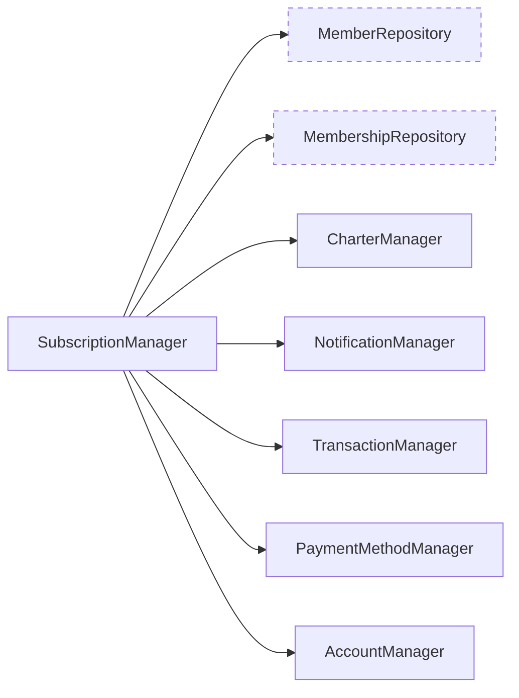

# Module `member`

## Schéma de dépendence par manager
### CharterManager

```mermaid
flowchart LR
    style CharterRepository fill:stroke-width:2px, stroke-dasharray: 5 5
    style MembershipRepository fill:stroke-width:2px, stroke-dasharray: 5 5
    CharterManager --> CharterRepository
    CharterManager --> MembershipRepository
```

### MailinglistManager

```mermaid
flowchart LR
    style MailinglistRepository fill:stroke-width:2px, stroke-dasharray: 5 5
    MailinglistManager --> MailinglistRepository
```

### MemberManager

```mermaid
flowchart LR
    style MemberRepository fill:stroke-width:2px, stroke-dasharray: 5 5

    MemberManager --> MemberRepository
    MemberManager --> AccountManager
    MemberManager --> AccountTypeManager
    MemberManager --> DeviceIpManager
    MemberManager --> MailinglistManager
    MemberManager --> SubscriptionManager
```

### NotificationManager

```mermaid
flowchart LR
    style NotificationRepository fill:stroke-width:2px, stroke-dasharray: 5 5
    style NotificationTemplateRepository fill:stroke-width:2px, stroke-dasharray: 5 5

    NotificationManager --> NotificationRepository
    NotificationManager --> NotificationTemplateRepository
```

### SubscriptionManager

```mermaid
flowchart LR
    style MemberRepository fill:stroke-width:2px, stroke-dasharray: 5 5
    style MembershipRepository fill:stroke-width:2px, stroke-dasharray: 5 5

    SubscriptionManager --> MemberRepository
    SubscriptionManager --> MembershipRepository
    SubscriptionManager --> CharterManager
    SubscriptionManager --> NotificationManager
    SubscriptionManager --> TransactionManager
    SubscriptionManager --> PaymentMethodManager
    SubscriptionManager --> AccountManager
```
