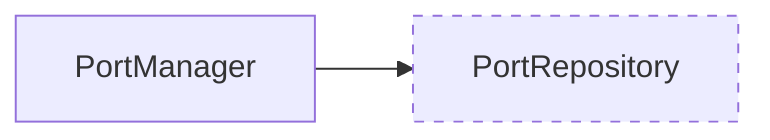
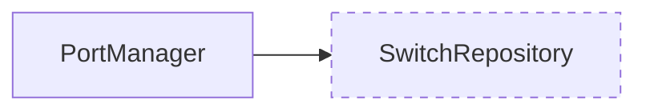
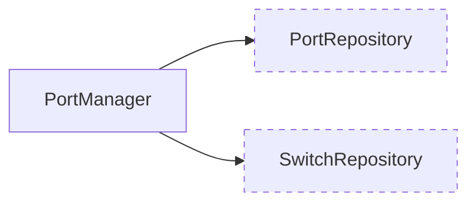

# Module `network`

## Schéma de dépendence par manager
### PortManager

```mermaid
flowchart LR
    style PortRepository fill:stroke-width:2px, stroke-dasharray: 5 5

    PortManager --> PortRepository
```

### PortManager

```mermaid
flowchart LR
    style SwitchRepository fill:stroke-width:2px, stroke-dasharray: 5 5

    PortManager --> SwitchRepository
```

### SwitchNetworkManager

```mermaid
flowchart LR
    style PortRepository fill:stroke-width:2px, stroke-dasharray: 5 5
    style SwitchRepository fill:stroke-width:2px, stroke-dasharray: 5 5

    PortManager --> PortRepository
    PortManager --> SwitchRepository
```
