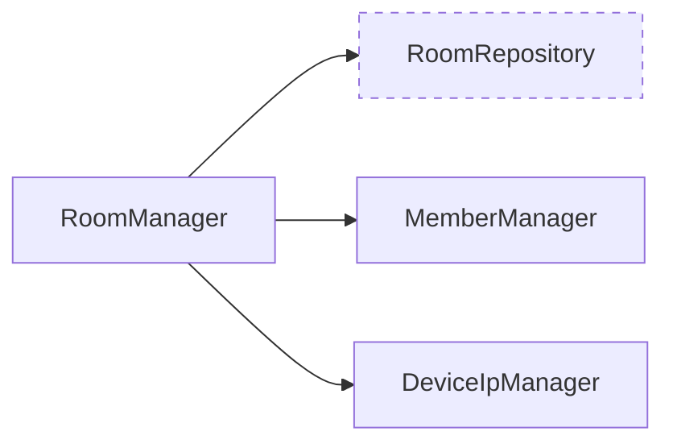

# Module `room`

## Schéma de dépendence par manager
### RoomManager

```mermaid
flowchart LR
    style RoomRepository fill:stroke-width:2px, stroke-dasharray: 5 5

    RoomManager --> RoomRepository
    RoomManager --> MemberManager
    RoomManager --> DeviceIpManager
```
