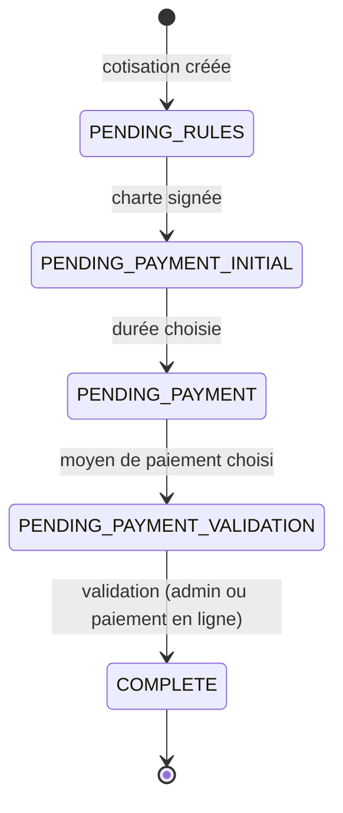

# Cycle de vie des adhésions

Chaque cotisation est une ligne de la table `membership` avec un statut. Le statut affiché pour un adhérent est celui de sa dernière cotisation, ou `INITIAL` s'il n'en a aucune.

Le code est dans `backend/adh6/member/subscription_manager.py` (création, mise à jour, validation) et `charter_manager.py` (signature de la charte).

## Statuts

| Statut | Signification |
|---|---|
| `INITIAL` | Aucune cotisation en base. Ce statut n'est jamais stocké : il est calculé quand l'adhérent n'a pas de ligne dans `membership`. |
| `PENDING_RULES` | Cotisation créée, en attente de la signature de la charte MiNET. |
| `PENDING_PAYMENT_INITIAL` | Charte signée, en attente de la durée. |
| `PENDING_PAYMENT` | Durée choisie, en attente du moyen de paiement. |
| `PENDING_PAYMENT_VALIDATION` | Moyen de paiement choisi, en attente de validation. |
| `COMPLETE` | Cotisation validée : la date de départ est prolongée, l'écriture comptable est créée et le reçu est envoyé. |
| `CANCELLED`, `ABORTED` | Prévus dans le modèle et traités comme des cotisations terminées, mais aucun code ne les attribue aujourd'hui. |

## Règles utiles

- **Créer un adhérent crée aussi sa première cotisation**, en `PENDING_RULES`, ou directement en `PENDING_PAYMENT_INITIAL` si la charte est déjà signée.
- **Plusieurs étapes peuvent être franchies en un seul appel** : une création ou une mise à jour avance tant que les informations fournies le permettent. Avec la charte signée, une durée et un moyen de paiement, on arrive directement en `PENDING_PAYMENT_VALIDATION`.
- **Une seule cotisation en cours à la fois** : on ne peut en créer une nouvelle que si la dernière est `COMPLETE`, `CANCELLED` ou `ABORTED`. Sinon, il faut mettre à jour celle en cours.
- **Le paiement en ligne valide aussi** : payment.minet.net (HelloAsso) appelle la validation avec une clé d'API, et envoie lui-même le reçu.
- **La cotisation wifi uniquement** (sans chambre, 9 €) passe le compte en wifi uniquement et le déplace en chambre 666 à la validation. Valider une cotisation classique retire ce mode.
- **Signature via Keycloak** : Keycloak écrit la date de signature directement en base, sans passer par `charter_manager.sign`. Une cotisation déjà en `PENDING_RULES` n'avance donc pas toute seule : elle avance au prochain appel de mise à jour, qui relit la signature.
- **Modifier l'identité d'un adhérent** (login, nom, prénom, mail) n'est possible que si sa dernière cotisation est terminée.
